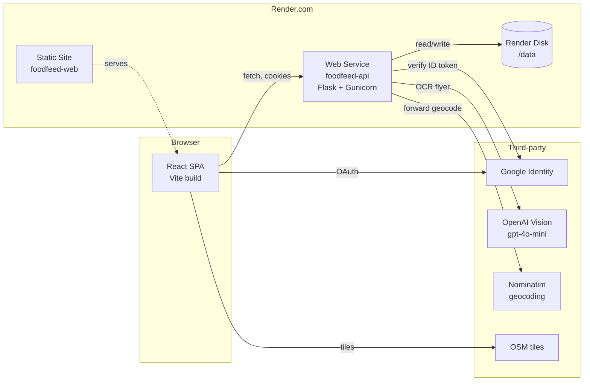

# System architecture

```mermaid
flowchart LR
  subgraph Client [Browser]
    UI[React SPA<br/>Vite build]
  end

  subgraph Render [Render.com]
    Static[Static Site<br/>foodfeed-web]
    API[Web Service<br/>foodfeed-api<br/>Flask + Gunicorn]
    Disk[(Render Disk<br/>/data)]
    API -->|read/write| Disk
    Static -.serves.-> UI
  end

  subgraph External [Third-party]
    GIS[Google Identity]
    OAI[OpenAI Vision<br/>gpt-4o-mini]
    NOM[Nominatim<br/>geocoding]
    OSM[OSM tiles]
  end

  UI -->|fetch, cookies| API
  UI -->|OAuth| GIS
  UI -->|tiles| OSM
  API -->|verify ID token| GIS
  API -->|OCR flyer| OAI
  API -->|forward geocode| NOM
```

Render Disk holds SQLite (`/data/foodfeed.db`) and uploaded flyer photos (`/data/uploads`), so both survive service restarts and redeploys.
