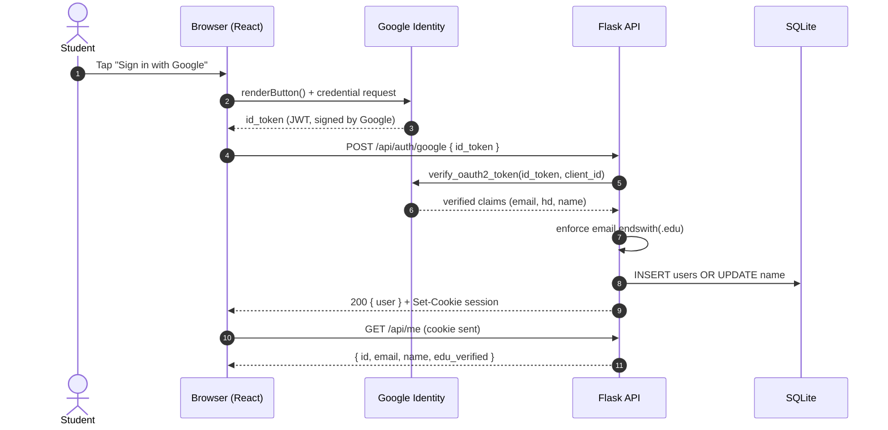

# Google Sign-In sequence

```mermaid
sequenceDiagram
  autonumber
  actor U as Student
  participant B as Browser (React)
  participant G as Google Identity
  participant A as Flask API
  participant DB as SQLite

  U->>B: Tap "Sign in with Google"
  B->>G: renderButton() + credential request
  G-->>B: id_token (JWT, signed by Google)
  B->>A: POST /api/auth/google { id_token }
  A->>G: verify_oauth2_token(id_token, client_id)
  G-->>A: verified claims (email, hd, name)
  A->>A: enforce email endswith(.edu)
  A->>DB: INSERT users OR UPDATE name
  A-->>B: 200 { user } + Set-Cookie session
  B->>A: GET /api/me (cookie sent)
  A-->>B: { id, email, name, edu_verified }
```

The `.edu` gate and Google's ID-token signature check are independent — a spoofed token still fails at step 5.
