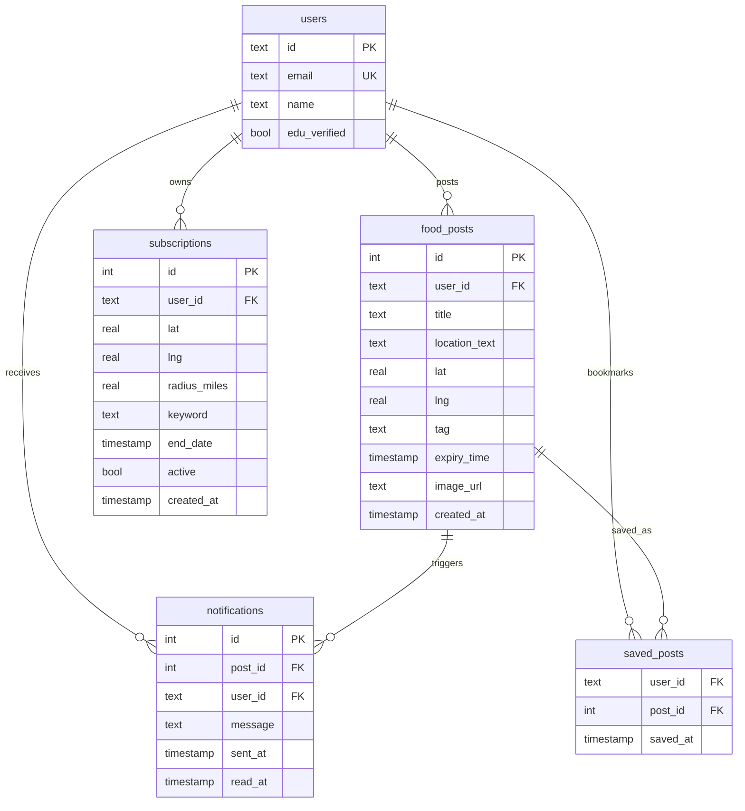

# Entity-relationship diagram

```mermaid
erDiagram
  users ||--o{ food_posts : posts
  users ||--o{ subscriptions : owns
  users ||--o{ notifications : receives
  users ||--o{ saved_posts : bookmarks
  food_posts ||--o{ notifications : triggers
  food_posts ||--o{ saved_posts : saved_as

  users {
    text id PK
    text email UK
    text name
    bool edu_verified
  }

  food_posts {
    int id PK
    text user_id FK
    text title
    text location_text
    real lat
    real lng
    text tag
    timestamp expiry_time
    text image_url
    timestamp created_at
  }

  subscriptions {
    int id PK
    text user_id FK
    real lat
    real lng
    real radius_miles
    text keyword
    timestamp end_date
    bool active
    timestamp created_at
  }

  notifications {
    int id PK
    int post_id FK
    text user_id FK
    text message
    timestamp sent_at
    timestamp read_at
  }

  saved_posts {
    text user_id FK
    int post_id FK
    timestamp saved_at
  }
```

`saved_posts` uses a composite primary key `(user_id, post_id)`, so re-saving is idempotent.
