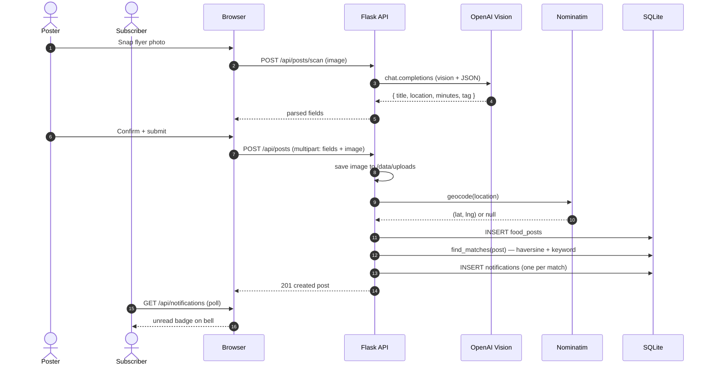

# Post creation → match → notify pipeline

Matching is synchronous inside `POST /api/posts` — adequate for MVP scale. Notification inserts are wrapped in a SAVEPOINT so a matching bug can't roll back the post itself.
